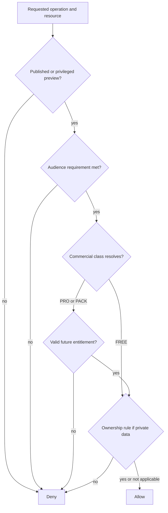

# CockpitPath Access Control

**Status:** Accepted v0.1 
**Last updated:** 2026-08-24

## Purpose

Access control answers whether an actor may perform an operation on content or user-owned state. It is distinct from authentication, progress, publication status, and billing. v0.1 is free; no billing or checkout is implemented.

## Access dimensions

Do not overload one field to represent unrelated questions.

| Dimension | Question | Initial values |
| --- | --- | --- |
| Publication | May runtime users see this revision? | `PUBLISHED` or not published |
| Audience | Is an account required? | `PUBLIC`, `AUTHENTICATED` |
| Commercial class | What future product grant is required? | `FREE`, `PRO`, `PACK`, `INHERIT` |
| Ownership | Who owns this private row? | Authenticated `user_id` |

For v0.1, released beta learning content resolves commercially to `FREE`. Learning routes require authentication by default so progress works consistently. Landing pages, catalog summaries, and deliberately selected samples may be `PUBLIC`. Public access is explicit, never inferred from `FREE`.

## Decision flow

## Central authorization boundary

Server-only domain logic receives the authenticated actor, requested operation, canonical resource identity, publication metadata, and entitlements where relevant. React components may display the result but must not implement independent rules such as `user.isPro`.

Every sensitive Server Action or Route Handler repeats authorization. A prior page render is not proof that a later mutation is permitted. Denials return a stable error category without revealing protected content.

## Content inheritance

Commercial rules should attach to meaningful scopes, normally an Aircraft Implementation, content pack, or Journey. Children may use `INHERIT`. Resolution walks an explicit allowed parent relationship, never a guessed slug hierarchy.

Rules:

- An explicit child restriction may be stricter than its parent only when product policy approves the exception.
- A Journey advertised as accessible must not contain inaccessible required steps.
- Cross-linked content is independently checked before details are returned.
- Search, previews, and media resolution apply the same decision as direct navigation.
- Cycles or unresolved inheritance fail closed during publication.

## Progress independence

Progress writes require identity and ownership, not a commercial entitlement record as their storage key. A future entitlement loss blocks protected content access but does not delete or overwrite progress. Restored access reveals prior progress again.

## PostgreSQL RLS

RLS is mandatory defense in depth for every exposed user-owned table.

- A user may select, insert, and update only rows whose `user_id` equals the authenticated database subject.
- User-owned identifiers are set or checked from the authenticated subject.
- No normal user deletes another user's rows.
- Draft content and editorial metadata are not exposed to normal browser roles.
- Policies use explicit grants and `WITH CHECK` rules, not only `USING` filters.

Published content is loaded through server-controlled data access in v0.1. If direct browser reads are later exposed, their grants and RLS must implement the same publication and access policy first; an anonymous Supabase key alone is not authorization.

Privileged publishing uses a server-only administrative credential and bypasses user RLS only for the narrow publishing operation.

## Future entitlements

An entitlement contains a stable key, source, validity interval, and optional revocation. Sources may later include subscription, pack purchase, beta, promotion, partner, or administrative grant. Billing events may create entitlements, but payment-provider records are not the access decision themselves.

`PRO` and `PACK` are modeled now only to prevent coupling. No product UI, checkout, subscription state, or paid-media enforcement is required for v0.1.

## Required tests

- Anonymous, authenticated user, different authenticated user, and privileged publisher roles.
- Public preview versus authenticated free learning content.
- Draft and archived content denial.
- User A cannot read or mutate User B progress.
- Search and cross-links do not leak inaccessible titles or metadata.
- Required Journey content has coherent inherited access.
- Future entitlement expiry and revocation preserve progress.
