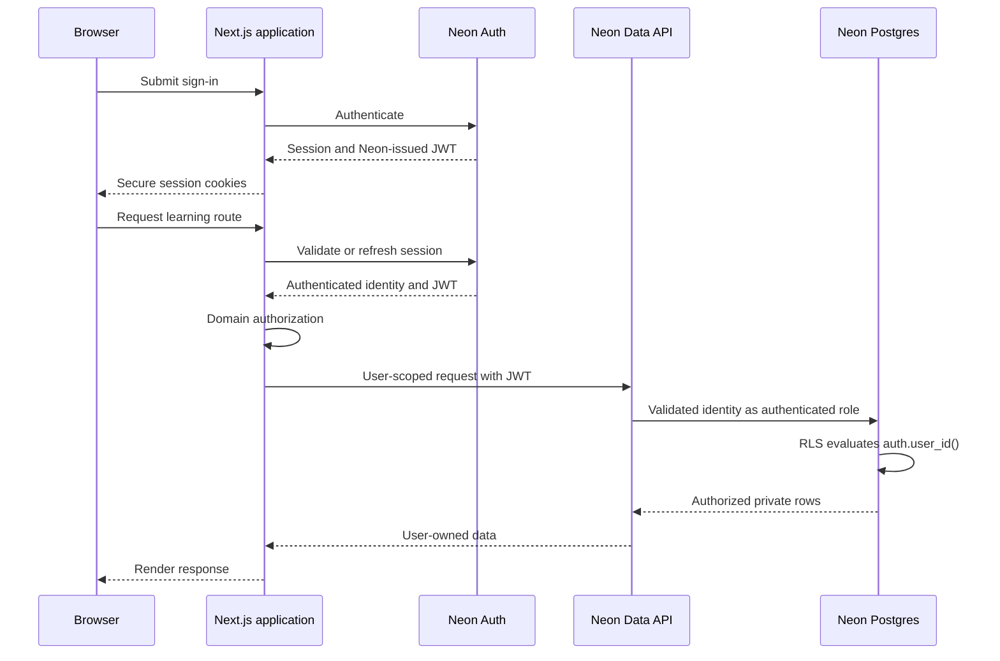

# CockpitPath Authentication Architecture

**Status:** Accepted v0.1 
**Last updated:** 2026-08-24

## Purpose

Authentication establishes user identity for persistent progress and future entitlements. Neon Auth owns authentication credentials and sessions in its managed `neon_auth` schema; CockpitPath owns only the separate application profile and domain data. Current Neon Auth is built on Better Auth. Authorization is defined separately in [access-control.md](access-control.md).

## v0.1 requirements

- Email and password sign-up, sign-in, sign-out, and password reset.
- A persistent session that works in Next.js Server Components, Server Actions, Route Handlers, and interactive browser flows.
- Server-side protection for authenticated application routes and mutations.
- A minimal application profile keyed by the Neon Auth user identity.
- Safe redirects back to an allowed CockpitPath route after authentication.

Social identity providers, organization accounts, multi-factor enforcement, anonymous-to-account progress migration, and custom identity infrastructure are not v0.1 requirements.

## Session flow

Neon Auth owns authentication identity and sessions. Phase 1B.2 proved that authenticated user-scoped database operations can carry a Neon-issued JWT through the Neon Data API, which validates the token and exposes the trusted subject to PostgreSQL through `auth.user_id()` for RLS evaluation.

This remains a server-first flow: browser requests cross the Next.js application boundary, Next.js performs domain authorization, and its user-scoped data access uses the Data API. Data API browser capability does not make the browser an authorization boundary.

Use the current supported Neon Auth server-rendering integration at implementation time. Cookie creation, refresh, and deletion must occur only in contexts that can write response cookies. Exact SDK calls, session adapters, and Data API client APIs belong to Phase 1B.3 rather than this architecture contract.

## Branch-aware identity

Neon Auth stores authentication state in the Neon database. Users, sessions, configuration, and related identity state therefore branch with database data, and each branch has isolated authentication configuration and an endpoint associated with that branch.

This supports realistic development and test environments, but copied authentication data remains sensitive. Every application environment must use the intended branch and authentication endpoint. Branching does not make production-derived identity safe for unrestricted use; data minimization, schema-only branching, or sanitization must be considered when real user data exists.

## Trust boundaries

- Treat every browser-supplied user ID as untrusted. Derive the acting user from the validated session.
- Never accept an ownership field that allows a client to write progress for another user.
- Browser route guards improve UX but are not authorization controls.
- Privileged Neon database credentials and R2 credentials remain server-only. Database owner or `BYPASSRLS` credentials are never used for normal user runtime operations.
- Do not store passwords or duplicate credential data in CockpitPath tables.

User-owned schema must use a column type compatible with the actual Neon Auth subject returned by `auth.user_id()`. Do not assume that the identity is a UUID; verify the contract during final SQL schema design.

## Route behavior

Public routes include the landing experience, authentication routes, and explicitly published previews. Learning routes that load or mutate personal progress require authentication by default. If a public learning sample is introduced, it must be explicitly marked public and must not imply cross-device progress.

An unauthenticated request to a protected page should redirect to sign-in with a validated relative return path. APIs and Server Actions should return an authentication error rather than HTML redirect behavior where that is the clearer contract.

## Profile lifecycle

`UserProfile.user_id` references the Neon Auth identity without duplicating authentication-owned user fields. Profile creation must be idempotent and must not block authentication if optional profile fields are absent. The profile contains no role or entitlement shortcut such as `is_pro`; access comes from centralized policy and future entitlement records.

Account deletion is not fully specified for v0.1. Before implementing it, define retention, progress deletion, audit needs, and Neon Auth/application-data deletion order in a separate approved policy.

## Failure handling

- Expired sessions should refresh when possible, then return the user to sign-in without losing a safe return route.
- Authentication errors must not expose whether an account exists beyond provider-safe behavior.
- Password reset and email confirmation redirects must allowlist application origins.
- Rate-limit sensitive endpoints according to observed abuse and provider capabilities.

## Required tests

- Sign-up, sign-in, sign-out, session refresh, and password reset.
- Protected server-rendered route behavior with missing, expired, and valid sessions.
- Rejection of forged user IDs and unsafe return URLs.
- No privileged secret in browser bundles or responses.
- RLS continues to isolate users even if application authorization is bypassed.

## Future-ready boundary

Future identity providers may link to the same Neon Auth user identity. Authentication does not grant paid access by itself: identity, entitlement, and progress remain independent.
