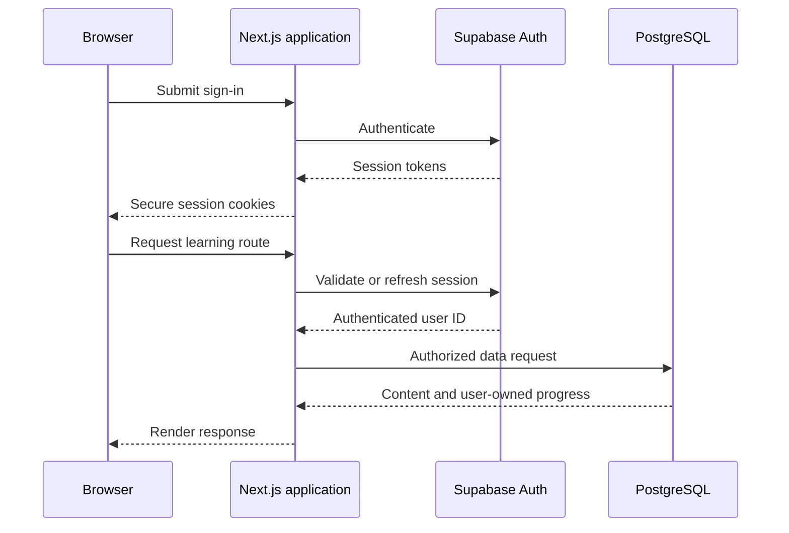

# CockpitPath Authentication Architecture

**Status:** Accepted v0.1 
**Last updated:** 2026-08-24

## Purpose

Authentication establishes user identity for persistent progress and future entitlements. Supabase Auth owns credentials and sessions; CockpitPath owns only the application profile and domain data. Authorization is defined separately in [access-control.md](access-control.md).

## v0.1 requirements

- Email and password sign-up, sign-in, sign-out, and password reset.
- A persistent session that works in Next.js Server Components, Server Actions, Route Handlers, and interactive browser flows.
- Server-side protection for authenticated application routes and mutations.
- A minimal profile keyed by the Supabase Auth user ID.
- Safe redirects back to an allowed CockpitPath route after authentication.

Social identity providers, organization accounts, multi-factor enforcement, anonymous-to-account progress migration, and custom identity infrastructure are not v0.1 requirements.

## Session flow

Use the current supported Supabase server-rendering integration at implementation time. Cookie creation, refresh, and deletion must occur only in contexts that can write response cookies.

## Trust boundaries

- Treat every browser-supplied user ID as untrusted. Derive the acting user from the validated session.
- Never accept an ownership field that allows a client to write progress for another user.
- Browser route guards improve UX but are not authorization controls.
- Supabase service-role credentials and R2 credentials remain server-only.
- Do not store passwords or duplicate credential data in CockpitPath tables.

## Route behavior

Public routes include the landing experience, authentication routes, and explicitly published previews. Learning routes that load or mutate personal progress require authentication by default. If a public learning sample is introduced, it must be explicitly marked public and must not imply cross-device progress.

An unauthenticated request to a protected page should redirect to sign-in with a validated relative return path. APIs and Server Actions should return an authentication error rather than HTML redirect behavior where that is the clearer contract.

## Profile lifecycle

`UserProfile.user_id` references the Supabase Auth identity. Profile creation must be idempotent and must not block authentication if optional profile fields are absent. The profile contains no role or entitlement shortcut such as `is_pro`; access comes from centralized policy and future entitlement records.

Account deletion is not fully specified for v0.1. Before implementing it, define retention, progress deletion, audit needs, and Supabase Auth deletion order in a separate approved policy.

## Failure handling

- Expired sessions should refresh when possible, then return the user to sign-in without losing a safe return route.
- Authentication errors must not expose whether an account exists beyond provider-safe behavior.
- Password reset and email confirmation redirects must allowlist application origins.
- Rate-limit sensitive endpoints according to observed abuse and provider capabilities.

## Required tests

- Sign-up, sign-in, sign-out, session refresh, and password reset.
- Protected server-rendered route behavior with missing, expired, and valid sessions.
- Rejection of forged user IDs and unsafe return URLs.
- No privileged secret in browser bundles or responses.
- RLS continues to isolate users even if application authorization is bypassed.

## Future-ready boundary

Future identity providers may link to the same Supabase Auth user identity. Authentication does not grant paid access by itself: identity, entitlement, and progress remain independent.
