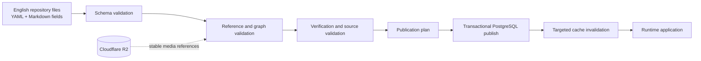

# CockpitPath Content System

**Status:** Accepted v0.1<br>
**Last updated:** 2026-08-24

## Purpose

CockpitPath authors structured learning content in the repository, validates the connected learning graph, and publishes approved runtime content into PostgreSQL. UI components render published data; they are not a permanent content store.

Related contracts are defined in [data-model.md](data-model.md), the [authoring guide](../content/authoring-guide.md), and the [publishing workflow](../content/publishing-workflow.md).

## System boundary



The authoring tree is the editorial source of truth. PostgreSQL is the runtime source of truth. Runtime edits must not be made manually and then treated as authored history.

## Authoring format

Use UTF-8 YAML files for structured entities. Rich explanatory fields may contain CommonMark Markdown as YAML block strings. This keeps relationships explicit and reviewable without introducing a custom CMS. The application remains JavaScript; validation code and tooling must be JavaScript unless a third-party tool requires otherwise.

One file should normally own one primary entity plus closely owned children. Large ordered collections, particularly Procedure Steps, may be split when file size harms review, but splitting must not change entity identity or order semantics.

## Conceptual repository layout

```text
content/
├── catalog/
│   ├── aircraft/
│   ├── simulators/
│   └── add-on-products/
└── implementations/
    └── ifly-b737-max-8-msfs2024/
        ├── implementation.yaml
        ├── media/
        ├── cockpit/
        ├── concepts/
        ├── systems/
        ├── procedures/
        └── journeys/
```

This is an implementation target, not application source created by this documentation task.

## Validation layers

Validation must be deterministic and must fail with file path, content key, rule, and actionable message.

1. Parse: valid UTF-8 and YAML with no ambiguous duplicate keys.
2. Schema: required fields, enums, types, bounds, and allowed Markdown.
3. Identity: unique and valid content keys; no key reuse.
4. References: every target exists and has an allowed kind.
5. Scope: implementation-specific relationships stay within one Aircraft Implementation unless explicitly shareable.
6. Graph: valid hierarchy, journey order, procedure order, system edges, and no forbidden dangling relationships.
7. Media: stable Media Asset exists, required variant metadata is coherent, hotspot bounds are valid.
8. Sources and verification: publication policy is satisfied; placeholders cannot qualify.
9. Access: publication and visibility values are explicit and compatible with parent inheritance.
10. Publication: only eligible records appear in the publish plan.

Warnings may identify non-blocking editorial issues. Errors always prevent publication. CI and local validation must apply the same rules.

## Lifecycle semantics

The canonical content lifecycle is:

```text
DRAFT → REVIEW → VERIFIED → PUBLISHED → ARCHIVED
```

`VERIFIED` and `PUBLISHED` are independent decisions. Publication requires sufficient verification under the applicable policy, but verification alone never exposes content. A published record may be archived without deleting its identity or referenced progress.

`ContentRecord.status` is the sole canonical editorial lifecycle field. A publishable domain entity with a `content_record_id` derives its editorial state from that record and must not persist a second lifecycle field. Other state must use a distinct name and enum: for example, user-facing `AVAILABLE`, `PARTIAL`, and `COMING_SOON` belong to `availability`; platform support belongs to `support_status`; progress and verification use their own domain-specific states. None may duplicate the editorial lifecycle under a second field.

## Publication contract

A publisher creates a complete plan before writing. The plan includes inserts, updates, archives, unchanged hashes, reference resolutions, and affected cache tags. Publishing then:

- resolves stable keys to UUID identities;
- uses upsert semantics without replacing stable identities;
- increments revision only when publishable content changes;
- stores a deterministic content hash;
- applies relational changes transactionally;
- records a publication identifier and outcome;
- never silently deletes records absent from a partial input scope;
- invalidates only affected runtime caches after commit.

R2 uploads are not part of the database transaction. Referenced objects and metadata must exist before the database publish can commit.

## Revision and compatibility

Editorial wording, typo fixes, and clarified descriptions retain identity. A semantic replacement receives a new key. Reordering changes sequence, not identity. A publisher must flag removed or semantically changed steps that already have progress so the change receives an explicit compatibility decision.

Rollback republishes a known validated repository revision. It does not mutate authored history or restore database snapshots as a normal content operation.

## Runtime reads

Runtime queries return published, access-allowed records and their resolved relationships. Draft and review content is available only to explicitly privileged preview tooling. UI code must not infer missing graph relationships from slugs or hard-coded maps.

Published content may be cached by aircraft, journey, procedure, cockpit view, or system. Private progress and access decisions must never enter shared caches.

## Not included in v0.1

- Custom visual CMS.
- Browser-based public authoring.
- User-generated content.
- Background job infrastructure.
- Automated aircraft facts or AI-generated procedures.
- Database-to-repository reverse synchronization.
