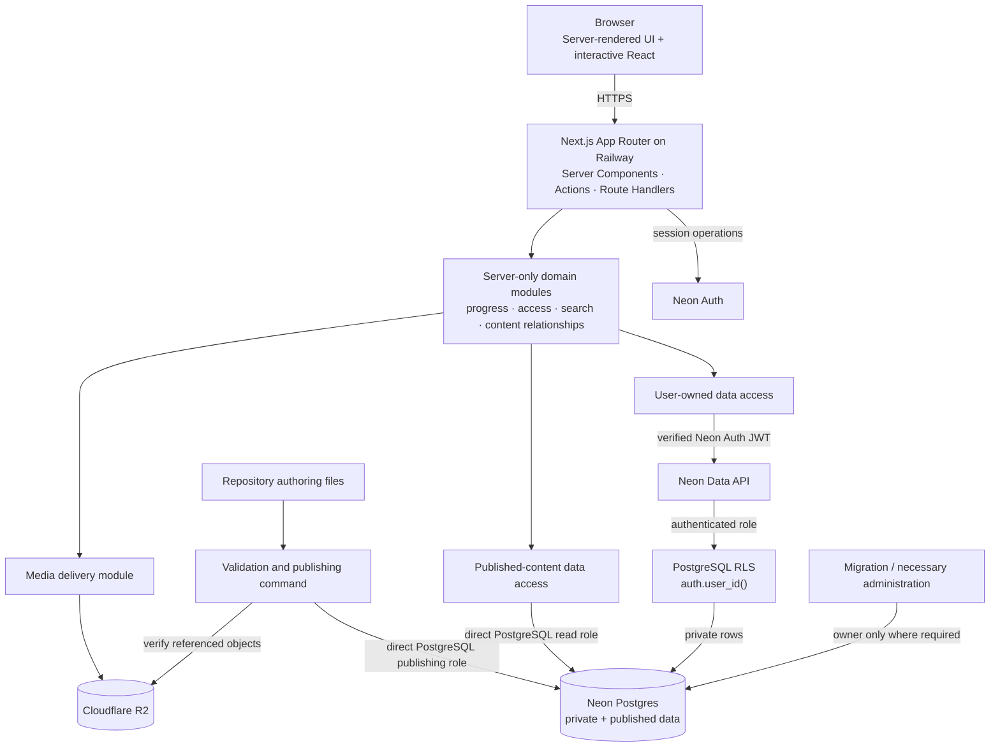

# CockpitPath Architecture Dependency Map

**Status:** Accepted v0.1 
**Last updated:** 2026-08-24

This map identifies allowed dependencies and trust boundaries. It complements the deployment topology in [overview.md](overview.md); boxes are modules or managed platforms, not microservices.

## Dependency rules

- Presentation may depend on domain interfaces, not directly on privileged credentials.
- Domain modules may depend on validation and data-access interfaces, not React components.
- Browser requests cross the Next.js boundary; Data API browser capability does not make the browser CockpitPath's authorization boundary.
- User progress reads and mutations pass through server/domain authorization, then the Data API with a verified Neon Auth JWT, and are also constrained by PostgreSQL RLS.
- Published learning content is read through server-only direct PostgreSQL access using a dedicated least-privileged read role.
- The publishing command is a server-only administrative path with its own narrowly privileged PostgreSQL role, not a public runtime endpoint.
- The database owner and any `BYPASSRLS` role are reserved for migrations or necessary administration and are not normal runtime credentials.
- R2 stores binaries; PostgreSQL stores media identity, metadata, and relationships.
- No reverse dependency from authored content to UI modules is allowed.

Phase 1B.2 selected this boundary after a successful real Neon Auth-to-RLS proof. See [ADR-0012](../decisions/ADR-0012-user-scoped-data-api-and-server-postgres-access.md).

## v0.1 versus future-ready

The solid architecture above is required for v0.1. Future billing, protected-media signing, workers, and simulator integration may attach to domain boundaries later; none is deployed or required now.
