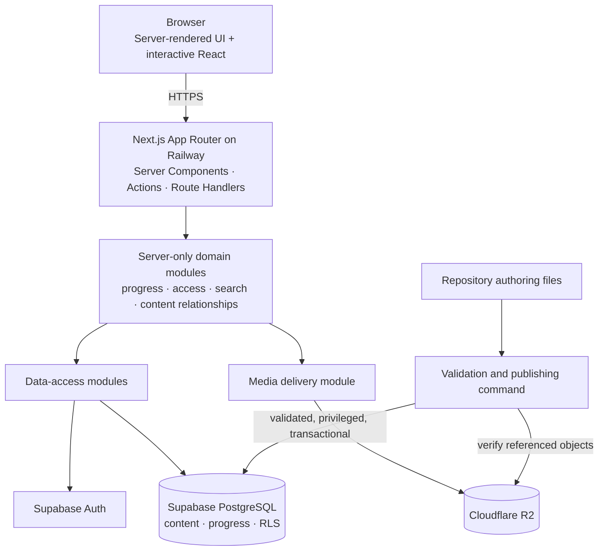

# CockpitPath Architecture Dependency Map

**Status:** Accepted v0.1 
**Last updated:** 2026-08-24

This map identifies allowed dependencies and trust boundaries. It complements the deployment topology in [overview.md](overview.md); boxes are modules or managed platforms, not microservices.

## Dependency rules

- Presentation may depend on domain interfaces, not directly on privileged credentials.
- Domain modules may depend on validation and data-access interfaces, not React components.
- Browser code may receive browser-safe Supabase configuration, but never privileged database or R2 credentials.
- User progress mutations pass through server authorization and are also constrained by RLS.
- Published learning content is read through server-controlled data access. Direct browser table access is not assumed.
- The publishing command is an administrative path, not a public runtime endpoint.
- R2 stores binaries; PostgreSQL stores media identity, metadata, and relationships.
- No reverse dependency from authored content to UI modules is allowed.

## v0.1 versus future-ready

The solid architecture above is required for v0.1. Future billing, protected-media signing, workers, and simulator integration may attach to domain boundaries later; none is deployed or required now.
