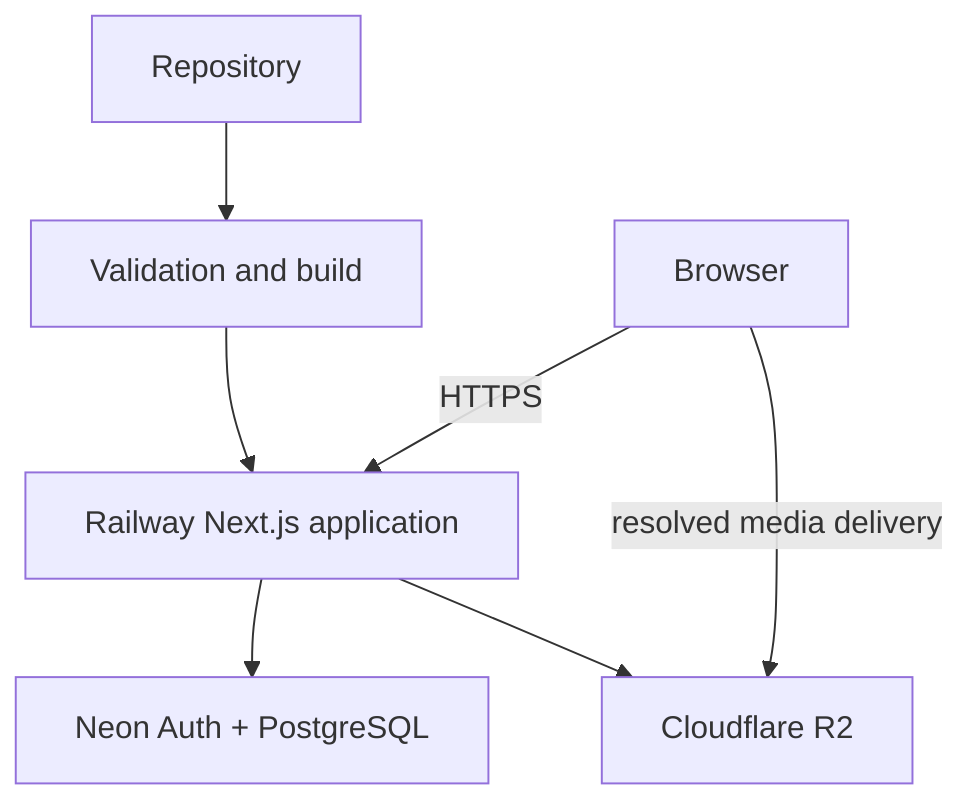
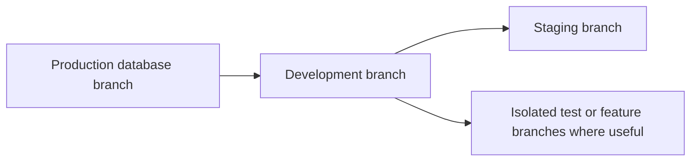

# CockpitPath Deployment Architecture

**Status:** Accepted v0.1 
**Last updated:** 2026-08-25

## Purpose

CockpitPath deploys one Next.js App Router application from one repository to Railway. Managed dependencies are Neon Postgres/Auth and Cloudflare R2. This document defines environment and release boundaries; it does not create infrastructure.

## Topology

There is no separate API server, worker, Redis, GraphQL service, or microservice in v0.1.

## Environments

Maintain at least local development, staging, and production application environments. Each has separate database/auth configuration, R2 namespace or bucket boundary, secrets, application origin, and content publication target. Production credentials must never be the default for development commands.

Neon database environments follow a branch-oriented model. The current staging
branch is created from the validated development state, while production remains
the unchanged default branch:

The labels are conceptual rather than locked Neon branch names. Each application environment uses the connection and Neon Auth endpoint for its intended branch. Because Neon Auth data branches with PostgreSQL data, branch handling must treat identity and session state as sensitive environment data.

Staging is the release rehearsal environment for migrations, RLS, content publication, media references, and critical user journeys. Preview or test branches may exist, but they must not receive production secrets or uncontrolled access to production-derived personal data. The local Neon CLI context remains linked to development. Staging commands use process-scoped configuration and must not rewrite the normal developer `.env.local` target.

## Staging on Railway

The staging application is one Railway service sourced from the repository's
`main` branch in a Railway environment named `staging`. Use Railway service
settings rather than the deprecated `railway.toml` / `railway.json` Config as
Code path for this new service. No Dockerfile or Railway-managed PostgreSQL
service is required.

The current external review endpoint is
[web-staging-d3e7.up.railway.app](https://web-staging-d3e7.up.railway.app).
The Railway service is connected to `OzAvrahami/cockpitpath` on `main`; source
auto-deployment remains disabled while the staging review candidate contains
uncommitted changes, so an older committed `main` build cannot replace it.

Configure the service with:

- Build command: `npm run build` (Railpack may detect this automatically).
- No privileged migration command in the web service.
- Start command: `npm run start`.
- Healthcheck path: `/api/health`.
- A Railway-provided public `*.up.railway.app` domain.

For the initial staging deployment, migrations are applied and verified through
a trusted operator boundary before the web deployment. The migration guard
accepts the exact `staging` branch name and continues to reject `production`.
The Railway web service must not receive `DATABASE_URL_UNPOOLED` or another
database-owner credential.

Automated privileged migrations are a deployment-security follow-up. Use a
separate trusted Railway migration service/job or CI workflow whose credential
is unavailable to the running Next.js web service. A migration failure in that
future boundary must stop the corresponding application release.

### Staging environment contract

Set these server-only Railway service variables; never use a `NEXT_PUBLIC_`
prefix for them:

- `NEON_BRANCH=staging`
- `NEON_AUTH_BASE_URL`
- `NEON_AUTH_COOKIE_SECRET` — a staging-only random secret of at least 32 characters
- `NEON_DATA_API_URL`
- `CONTENT_DATABASE_URL` — a staging-only login that is only a member of `cockpitpath_content_reader`

The staging content-reader login must read `cockpitpath_published` views but
must not read or modify raw editorial tables. The owner connection must not be
configured on the web service or used by the running application. Railway makes
service variables available at build and runtime; application code consumes
only the Auth, Data API, and restricted content-reader values.

Neon child branches inherit parent Postgres roles. Disable the inherited
development runtime login on staging, then provision a distinct staging login
only when its generated connection can be written directly to Railway's secret
store. Do not print it or keep a second copy in repository-managed files.

After Railway assigns the public domain, add only that HTTPS origin to the
staging branch's Neon Auth trusted domains when required by the provider. Do not
add wildcard origins and do not change production Auth configuration.

### Staging verification

Before accepting a deployment:

1. Apply migrations through the trusted staging operator boundary and confirm a second migration run applies nothing.
2. Run the live database security checks against staging.
3. Confirm the restricted content reader can access published views and cannot access editorial tables.
4. Confirm `/api/health`, `/`, and public Auth pages return safely over HTTPS.
5. Verify sign-up, protected account access, sign-out, sign-in, and session persistence with a staging-only test user.
6. Confirm missing verified Guide Mode content produces the intentional unavailable/not-found behavior.
7. Check desktop, tablet, 400–550 px companion, and mobile viewports for overflow and reachable navigation.
8. Inspect build, deployment, and request logs for secret or token leakage.

Do not publish synthetic learning content merely to make the staging application
look populated. Any temporary integration fixture must be unmistakably
synthetic and removed with its progress and Auth users after the test.

## Configuration classes

Browser-safe configuration is explicitly named and reviewed for exposure. Server-only configuration includes database administrative credentials, R2 write/signing credentials, publishing credentials, and future third-party secrets.

Configuration must validate at application startup with clear missing/invalid errors. Logs must report the variable name, not its value. Do not place secrets in repository files, build output, error responses, or browser bundles.

## Release pipeline

```mermaid
flowchart LR
    P[Pull request] --> V[Docs, content, lint, tests]
    V --> B[Production build]
    B --> S[Deploy staging]
    S --> M[Apply reviewed migrations]
    M --> C[Publish validated content]
    C --> E[Critical smoke and RLS tests]
    E --> A[Approve production]
    A --> D[Deploy application]
    D --> PM[Apply production migrations]
    PM --> PC[Publish approved content]
    PC --> H[Health and journey smoke checks]
```

Application, migration, and content revisions must be traceable. A release identifies the repository revision, migration set, and content publication ID. The exact order may use expand/contract changes when compatibility requires the old application and new schema to overlap safely.

## Database changes

All schema, grants, functions, and RLS changes use version-controlled migrations. Staging runs the same migrations in the same order. Backward-incompatible changes require an explicit rollout and rollback plan; a Railway application rollback cannot undo a destructive database migration by itself.

The migration runner is selected during Neon Phase 1B. Reproducibility must not depend on manual Neon Console edits, and an ORM is not required merely to own migrations.

## Content and media deployment

Content publication is a release gate separate from the application deployment. Validation produces a dry-run plan before privileged writes. Referenced R2 objects must exist before content publication. Publication triggers targeted cache invalidation after the database commit.

Do not automatically publish every repository draft during application deployment. The approved publication scope is explicit.

## Health and observability

The application should expose a lightweight health check that proves the process is responsive without leaking secrets. Deployment logs, server errors, failed migrations, failed publication, and dependency failures must be observable. A vendor-specific error monitoring service may be selected during implementation but is not mandated here.

Log structured request correlation where practical. Do not log session tokens, credentials, full authorization headers, or unnecessary user content.

## Rollback

- Application: redeploy a known compatible Railway build.
- Content: republish a known validated repository revision.
- Media: restore a prior stable media reference; immutable objects make this reversible.
- Database: prefer forward corrective migrations. Define a tested recovery procedure before any irreversible migration.

Rollback must account for compatibility across all four layers. Never assume one-click application rollback restores database or content state.

## Backups and recovery

Before production, confirm Neon backup, restore, branch-retention, and recovery capabilities appropriate to beta data, plus R2 object protection/versioning choices. Document a restore rehearsal and ownership. These provider-specific settings remain intentionally open until environments are provisioned.

## Release gates

- Production build succeeds using plain JavaScript.
- Migrations and RLS tests pass on staging.
- Content validation and dry-run publication have no errors.
- No unresolved media references.
- Authentication, start Journey, progress save, sign-out/sign-in, and resume smoke tests pass.
- Security and accessibility release checks meet [testing-strategy.md](testing-strategy.md).
