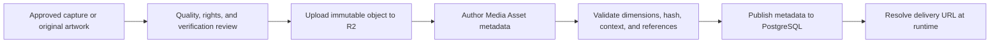

# CockpitPath Media Assets Architecture

**Status:** Accepted v0.1 
**Last updated:** 2026-08-24

## Purpose

Cloudflare R2 stores learning-media binaries. PostgreSQL stores stable Media Asset identity, storage metadata, capture context, verification metadata, and content relationships. Content references a Media Asset ID or authoring key, never a hard-coded delivery URL.

## Asset flow

## Identity and storage keys

- A Media Asset has a stable human-readable authoring key and a database UUID.
- Object keys are immutable or content-versioned. Replacing pixels creates a new object key and media revision.
- `original_filename` is provenance metadata, not identity.
- Storage bucket and public domain names are configuration, not authored content.
- A checksum should be recorded to detect accidental replacement and duplicate uploads.

Conceptual object keys may group by environment and implementation, but consumers must not parse object paths to infer domain relationships.

## Required metadata

At minimum: media key, asset type, storage key, MIME type, pixel dimensions, implementation scope where applicable, accessible description, rights/source status, verification status, and capture context. Add-on and simulator versions remain null until confirmed.

For cockpit captures, record the cockpit area or intended view, simulator UI state, camera/crop notes, and whether the image is an original capture. Do not claim verification from filename conventions.

## Asset types and variants

Initial types may include cockpit view, guide visual, aircraft identity image, system illustration, and supporting diagram. Variants such as `thumbnail`, `small`, `medium`, `large`, and `original` are delivery derivatives of one asset, not separate learning entities.

v0.1 may pre-generate only the variants actually needed. The model remains ready for more variants without requiring a worker service now. Each variant records dimensions, MIME type, file size, storage key, and checksum.

## Delivery

Free beta media may use a dedicated cached media domain. Delivery must use versioned URLs or immutable keys with long-lived cache headers. The application chooses a suitable variant and does not send the original to every viewport.

Future protected content may use short-lived signed access after a server entitlement check. This is future-ready behavior, not a requirement to implement signed URLs for all free v0.1 assets. R2 bucket visibility is not the access-control model.

## Hotspots and annotations

Base images contain no permanent instructional highlight, target box, label, or status. Hotspots are normalized structured records associated with a Cockpit View; see [hotspot guidelines](../content/hotspot-guidelines.md). One base image can serve many steps and controls.

Decorative image edits that are intrinsic to an asset are allowed only if they do not encode step-specific instruction. Source and edited derivatives must remain traceable.

## Upload and publication safety

- Upload is an authenticated administrative operation and never accepts arbitrary public objects.
- Allowlist image MIME types and verify file signatures; do not trust extensions.
- Enforce size and dimension limits appropriate to the asset class.
- Strip unnecessary embedded metadata where privacy or capture-path leakage is possible.
- Reject active content formats unless explicitly reviewed and safely served.
- An asset cannot publish until its object exists and required metadata validates.
- An object cannot be deleted while published content references it.

## Replacement and retirement

Replace a referenced asset by publishing a new revision or changing the relationship to a new Media Asset, then archive the old asset. Confirm no published or rollback-capable revision requires the object before deletion. v0.1 does not require automated garbage collection.

## Failure behavior

The UI should provide an explained failed-image state and retain the step action in text. Missing primary imagery is a publication error for content whose learning contract requires visual location; it is not silently tolerated by the publisher.

## Responsibilities

- Content editors choose the correct stable asset reference and accessible description.
- Media reviewers confirm quality, capture consistency, rights, and implementation match.
- Verification reviewers confirm version/context claims.
- The publishing tool validates object existence and metadata.
- Runtime code resolves URLs, variants, and future access without exposing credentials.
