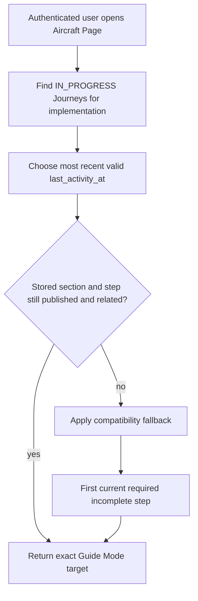

# CockpitPath Progress Model

**Status:** Accepted v0.1 
**Last updated:** 2026-08-24

## Purpose

Progress persists the user's learning position and completion independently of content and entitlements. It supports auto-save, standalone Procedures, Journey completion, and `Continue Learning` without gamification.

The domain entities are introduced in [data-model.md](data-model.md). This document defines behavior and mutation contracts rather than final SQL.

## Authoritative state

- `UserJourneyProgress` holds one user's state and explicit position for one Journey.
- `UserProcedureProgress` holds state and explicit position for a Procedure, including when reached through a Journey.
- `UserStepProgress` records a stable step as `COMPLETED` or `SKIPPED`.
- A Guide Mode density preference may be stored in a narrowly typed user preference; Quick and Learn never create separate progress.
- Percentages are derived from the current published required structure, not persisted as primary truth.

An absent progress row means not started. `IN_PROGRESS` includes a user who has left and may resume later.

## Completion semantics

`Done — Next` means the user asserts completion. v0.1 does not claim simulator verification. Completing a step:

1. Upserts the user's step record as `COMPLETED`.
2. Advances explicit procedure position when a next applicable step exists.
3. Updates procedure status and timestamps.
4. Updates Journey position and possibly advances its Journey Section.
5. Updates last activity.

These related changes should occur atomically. Retrying the same command is safe and cannot create duplicate completion.

`Skip` records `SKIPPED`; it never counts as completed. Whether an optional skipped step blocks procedure completion is a domain rule: optional skipped steps do not block, while a required skipped step keeps completion incomplete and must be clearly shown. v0.1 should avoid making required steps skippable unless UX explicitly supports that consequence.

Returning to an earlier step does not erase later completion. Marking a step incomplete or restarting a section is a separate explicit command and needs confirmation if it removes completion records.

## Resume selection

Explicit current position wins over guessing from the highest sequence number. If there is no active Journey, standalone Procedure progress may be offered separately, but it must not masquerade as the primary Journey resume target.

## Compatibility with content change

Progress references stable logical IDs. Wording fixes and reordering preserve completion. A semantic replacement uses a new step identity. When a stored target is archived:

- retain historical completion;
- exclude archived steps from current percentage calculations;
- resume at the next valid required incomplete step in the current published structure;
- record or log the fallback so content compatibility problems are diagnosable.

Publishing must flag destructive structural changes affecting existing progress. No content publish deletes historical progress.

## Concurrency and reliability

Progress mutations include the expected current entity and a unique operation identifier or equivalent idempotency contract. The server validates relationship and ownership from canonical data, not from client-provided sequence numbers.

Optimistic navigation is allowed. Until persistence succeeds, the UI must retain enough state to retry. A failed save produces a visible recoverable state; it must not display an unconditional `saved` confirmation. Last-write behavior must not allow a stale tab to move explicit position backward silently. Implementations may use an update version or timestamp precondition.

## Progress calculations

- Procedure denominator: current published required steps; optional steps are reported separately.
- Journey denominator: required Procedures or required steps according to the UI metric chosen, stated consistently.
- A Procedure is complete when all current required steps are complete.
- A Journey is complete when all required Journey Sections reference complete Procedures.
- Skipped required work remains visible rather than rounded into 100%.

The UI must not copy placeholder design counts into production. Counts come from published content.

## Privacy and authorization

Progress is private user-owned data. Server authorization derives the user from the session, and PostgreSQL RLS enforces ownership. Analytics events are not progress and cannot reconstruct authoritative completion.

## Required tests

- Idempotent completion, skip, retry, and double-click behavior.
- Atomic advancement across the end of a Procedure and Journey Section.
- Exact resume, most-recent Journey selection, and archived-step fallback.
- Quick/Learn switching leaves progress unchanged.
- User isolation under application rules and RLS.
- Stale-tab conflict behavior and recoverable network failure.
- Progress survives access loss and content revision.
