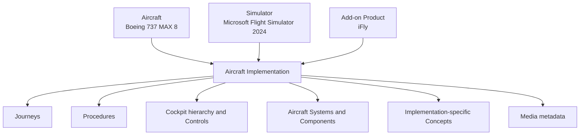

# CockpitPath Aircraft Content Structure

**Status:** Foundation v0.1 
**Last updated:** 2026-08-24

## Purpose

This document defines how content is scoped and assembled for an aircraft without encoding Boeing-specific assumptions into the platform.

## Identity hierarchy

An Aircraft describes the model/variant. A Simulator describes the platform family. An Add-on Product describes the third-party implementation. The Aircraft Implementation binds the three and scopes detailed content.

Do not assume that procedures, controls, imagery, or simulated behavior transfer to another add-on or simulator because the Aircraft name matches.

## v0.1 implementation

- Aircraft: Boeing 737 MAX 8.
- Add-on: iFly.
- Simulator: Microsoft Flight Simulator 2024.
- Primary Journey: `Cold & Dark → Takeoff`.
- Required Aircraft System: Electrical.

Exact add-on and simulator versions are verification metadata, not new implementation identities for every patch.

## Canonical Journey structure

The primary Journey references these Procedures as required Journey Sections in this exact order:

1. Power Up
2. IRS & Navigation
3. Overhead Preparation
4. FMC Initialization
5. Route Setup
6. Performance Setup
7. MCP Preparation
8. Before Pushback
9. Pushback
10. Engine Start
11. After Start
12. Taxi
13. Before Takeoff
14. Takeoff

Step counts are derived from verified published Procedures. Counts shown in design references are placeholders and must not be copied into authored content or tests.

## Reuse rules

A Journey Section references a Procedure; it does not contain a duplicated Procedure. A Procedure may later appear in multiple Journeys. Controls, Concepts, System Components, Cockpit Views, and Media Assets are likewise referenced by stable key.

Content relationships normally remain inside one Aircraft Implementation. A Concept may be shared only when its definition is genuinely implementation-independent; implementation-specific behavior belongs in scoped content or notes.

## Cockpit structure

Cockpit Areas form a semantic tree separate from images. Typical types are `COCKPIT`, `REGION`, `PANEL`, and `AREA`. Exact taxonomy must follow verified implementation needs. Cockpit Views render areas; Hotspots connect views to child areas or Controls.

Do not author the full cockpit for completeness. v0.1 prioritizes areas and controls required by the primary Journey: Overhead, MCP, Main Instrument Panel where required, Center Pedestal, and CDU/FMC.

## Systems structure

An Aircraft System contains Components, directed conceptual Relationships, Learning Sections, optional labeled learning Scenarios, and links to Controls, Concepts, and Procedures. v0.1 requires Electrical. Other systems remain optional only when verified content capacity permits.

## Availability and publication

Editorial lifecycle is separate from user availability. A System can be user-facing `COMING_SOON` without placeholder Components being published as technical content. `PARTIAL` must state its coverage boundary. `AVAILABLE` means its promised experience is published and verified to the required policy.

## Future aircraft

Adding another Aircraft Implementation should reuse schemas, validators, UI contracts, and genuinely general Concepts. It must bring its own verified cockpit hierarchy, imagery, procedures, systems, and progress scope. v0.1 does not create sample records merely to demonstrate this scalability.
