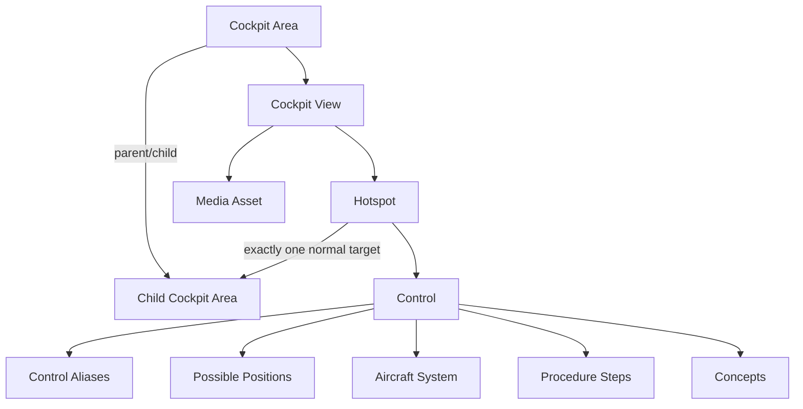

# Cockpit Content Model

**Status:** Foundation v0.1 
**Last updated:** 2026-08-24

## Purpose

Cockpit content gives Guide Mode and Cockpit Explorer a shared semantic and visual model. It connects physical cockpit location, reusable Controls, base imagery, dynamic Hotspots, Procedures, Systems, and Concepts.

## Model

## Cockpit Areas

An Area is a semantic place, not a screenshot. It has a stable key, implementation, parent, type, title, and order. Allowed initial types are `COCKPIT`, `REGION`, `PANEL`, and `AREA`. The root has no parent; every other published Area has one valid published parent in the same implementation.

The tree must support understandable breadcrumbs and `Guide me there`. Avoid arbitrary depth and avoid inventing a taxonomy from a design placeholder. Exact names receive technical review.

## Cockpit Views

A View associates one Area with one Media Asset and a role such as `OVERVIEW`, `PRIMARY`, `ALTERNATE`, `GUIDE`, or `CLOSEUP`. An Area may have multiple Views, but at most one primary View for a declared context.

Replacing imagery does not change the Area or Control identity. The View owns visual framing; the Area owns location meaning.

## Controls

A Control represents a selectable cockpit element. Initial types include `SWITCH`, `BUTTON`, `KNOB`, `LEVER`, `SELECTOR`, `DISPLAY`, `INDICATOR`, `ANNUNCIATOR`, `GAUGE`, `GROUP`, and `OTHER`.

Required authoring intent:

- canonical name and implementation scope;
- containing Cockpit Area;
- practical `what it does` and `when used` where verified;
- type;
- aliases only for genuine search discovery;
- possible positions only when meaningful;
- relationships to Systems, Concepts, other Controls, and Procedures.

Positions describe possible states, never current simulator state. A group may coexist with individual Controls when both levels offer distinct learning value.

## Hotspots

A Hotspot belongs to a View and normally targets exactly one child Area or one Control. It does not duplicate the target's name or explanation. Normalized coordinates and accessible labeling follow [hotspot-guidelines.md](hotspot-guidelines.md).

Progressive density is a content rule: root Views target major regions, panel Views target areas, and detailed Views target Controls. Do not publish hundreds of simultaneously exposed root hotspots.

## Procedure connections

Procedure Step-to-Control relationships carry a role: `ACTION_TARGET`, `VERIFY_TARGET`, or `CONTEXT`, plus order and an optional preferred Hotspot. A Step visual may reference a View, Media Asset, and Hotspot without duplicating the Control.

Reverse `Used in Procedures` lists are derived from relationships. Authors do not maintain a second manual list.

## System and Concept connections

A Control may relate to an Aircraft System and one or more Components/Concepts through explicit relationship records. `Related controls` are explicit symmetric or directed educational relationships; they are not inferred from proximity in an image.

## Search contract

Canonical name, alias, and area ancestry power search. A searchable visual Control must resolve to a published View and usable Hotspot so selecting a result can focus it. Search aliases never appear as the canonical cockpit label.

## Coverage states

v0.1 Cockpit Explorer coverage is driven by the primary Journey, not completeness. A published coverage statement must identify what is supported. `Coming Soon` areas do not contain unverified technical detail visible to users.

## Validation

- Area tree is acyclic, rooted, and implementation-consistent.
- View references an approved Media Asset with coherent dimensions/context.
- Primary-view uniqueness holds.
- Hotspot target exists, is reachable in the hierarchy, and is inside bounds.
- Control type, aliases, and positions use controlled structures.
- Cross-links stay within implementation except approved shared Concepts.
- Published searchable Controls have a valid navigation target.
- Technical claims meet source and verification policy.
