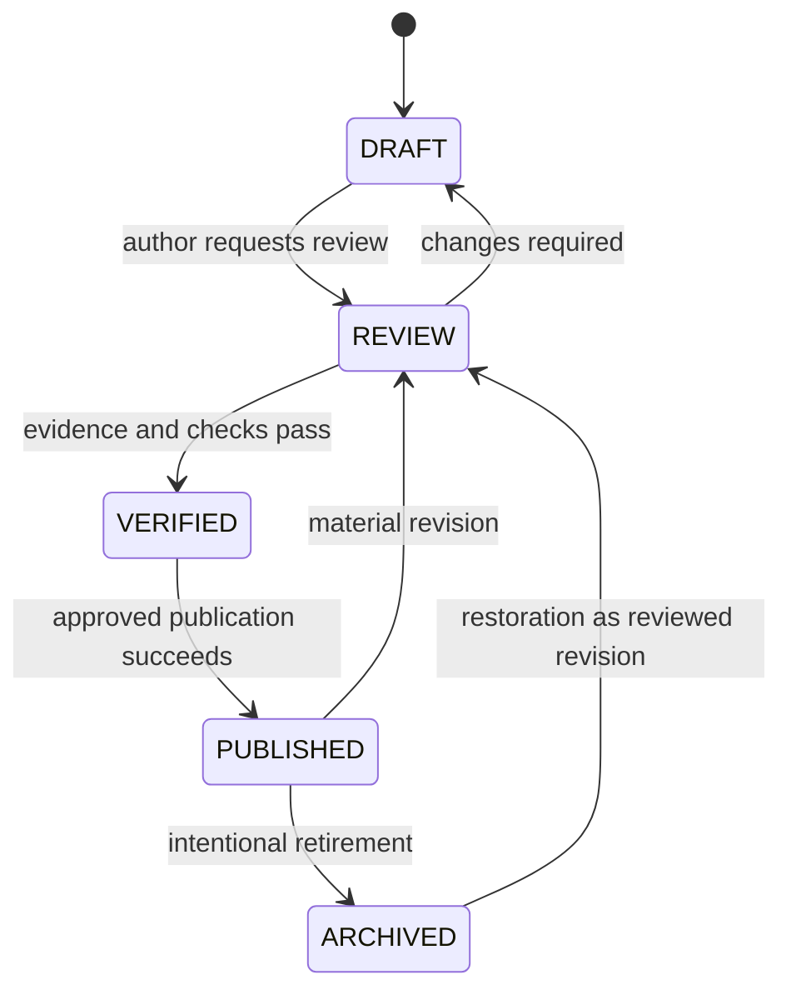

# CockpitPath Content Publishing Workflow

**Status:** Accepted v0.1 
**Last updated:** 2026-08-24

## Purpose

Publishing moves approved repository content into PostgreSQL runtime content. It is a controlled administrative workflow, not a public CMS feature and not an automatic side effect of deploying the web application.

## Lifecycle

## Responsibilities

- Author prepares content, source links, and relationships.
- Reviewer evaluates writing, graph integrity, and scope.
- Verifier records technical/media outcomes under [verification-policy.md](verification-policy.md).
- Publisher approves the exact scope, reviews the dry run, and uses server-only credentials.

The same person may perform multiple duties in beta, but each transition and result remains traceable.

## Workflow

1. Create a focused repository change using stable keys.
2. Run formatting plus schema, reference, graph, media, access, and verification validation.
3. Review human-readable diffs; do not review only generated output.
4. Confirm R2 objects and Media Asset metadata exist for every reference.
5. Move eligible content through review and verification states.
6. Generate a dry-run publication plan against staging.
7. Review inserts, updates, archives, unchanged records, key-to-UUID mappings, compatibility warnings, and cache effects.
8. Publish transactionally to staging.
9. Smoke-test Guide Mode, Cockpit Explorer, Systems, search, cross-links, and progress compatibility.
10. Approve and run the same repository revision/scope against production.
11. Record publication ID, repository revision, actor, time, environment, result, and content hashes.
12. Invalidate affected caches after commit and perform production smoke checks.

## Publication modes

- `validate`: no database or R2 writes.
- `plan` / dry run: compare source to target and report intended changes; no writes.
- `publish`: apply the reviewed plan to an explicit environment and scope.

Exact command names are chosen during implementation. Commands must default safely, print their target environment, and never infer production from missing configuration.

## Transaction and idempotency

Database content changes occur in one transaction per approved publication unit. A failed validation or write rolls back the unit. Re-running the same content hashes produces no duplicate entities or revision increments. Stable key-to-UUID mapping cannot change.

R2 upload happens before database publication and is not transactional with PostgreSQL. Unreferenced uploaded objects are harmless and can be reviewed later; a database record pointing to a missing object is not allowed.

## Deletion and omission

Absence from a partial publication scope never means delete. Retirement is an explicit archive operation. The plan reports all affected published relationships and progress before archival. Hard delete is restricted to never-published mistakes/test data under a separate deliberate operation.

## Progress compatibility gate

The plan flags:

- archived/replaced Steps with existing progress;
- required-step additions/removals;
- Journey Section reordering or replacement;
- semantic changes marked as retaining identity;
- changes that invalidate stored resume targets.

The publisher records a compatibility decision. Historical progress remains stored; current completion/resume follows [progress-model.md](../architecture/progress-model.md).

## Failure and rollback

On failure, preserve validation/publish logs without secrets and leave runtime content unchanged. Fix source and rerun; do not patch production rows manually.

Rollback means republishing a known validated repository revision and compatible graph. If a schema migration is involved, follow the deployment recovery plan; content rollback alone does not reverse database schema.

## Publication checklist

- English-only repository artifacts and valid syntax.
- Exact environment and scope confirmed.
- No placeholder design counts, facts, versions, dates, or URLs.
- Source and Verification Events cover the published hashes.
- Required Journey content is complete and access coherent.
- Media exists, rights/context recorded, hotspots reviewed.
- Dry run contains no unexplained identity change, archival, or cross-implementation link.
- Staging smoke tests pass.
- Publication and cache-invalidation outcomes are recorded.
