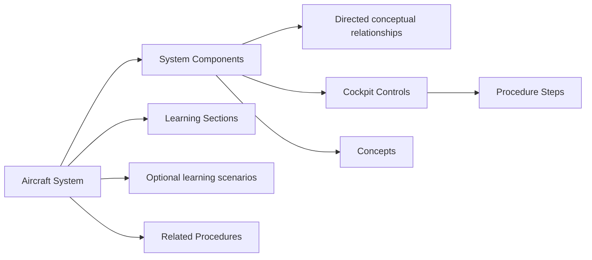

# Aircraft System Content Model

**Status:** Foundation v0.1 
**Last updated:** 2026-08-24

## Purpose

Aircraft Systems teaches verified conceptual relationships and operational relevance. It does not reproduce maintenance schematics, simulate engineering behavior, or display live aircraft state.

v0.1 requires one high-quality Electrical experience. Names and relationships shown in design references are illustrative until verified.

## Connected model

## Aircraft System

An Aircraft System has a stable key, implementation, title, short mental-model description, order, lifecycle, availability, and relationships. It must define a clear learner-facing coverage boundary.

## System Components

A Component represents a reusable conceptual element inside one System. Author:

- stable identity and title;
- component type/category where useful;
- concise `what it does`;
- operational `why it matters`;
- order/grouping;
- related Controls, Concepts, and Procedures.

Do not duplicate the Control definition inside the Component. Avoid a Component for every engineering detail; include only what the learning model needs.

## Relationships

A relationship is a verified directed edge with source Component, target Component, relationship type, optional concise label, direction, and order. Both endpoints belong to the same Aircraft System unless a future schema explicitly supports cross-system links.

The data stores meaning, not viewport geometry. Desktop, tablet, mobile, and accessible text views may arrange the same graph differently. Do not author pixel positions as the canonical system model.

No relationship may imply current power, flow, pressure, valve, or generator state. Cyan selection means focus only.

## Learning Sections

Sections provide progressive depth with stable keys and sequence. A section contains a title, summary, approved Markdown body, referenced Components/Concepts, and optional diagram focus. Section names shown in design references are provisional until the actual verified teaching structure is authored.

Use progressive disclosure rather than copying one long manual chapter. Connect explanations to cockpit operation and relevant Procedures.

## Learning Scenarios

A Scenario is an optional explicitly labeled educational configuration. It selects relationships/components to emphasize and includes a plain statement that it is conceptual, not detected simulator state. v0.1 does not require Scenarios to launch the Electrical page.

Scenario labels such as `Aircraft on Battery` are not automatically valid technical content; each must be sourced and verified before publication.

## Concepts

Concepts supply reusable foundational definitions. Use a general Concept only when it is genuinely stable across implementations. Put iFly/MSFS-specific behavior in implementation-scoped content or a verified Simulator Note.

## Cross-links

- Component-to-Control enables `View in Cockpit Explorer`.
- Procedure/System and Step/System links enable `Used in Procedures` and Learn Mode.
- Origin context is navigation state; it is not duplicated content.
- Reverse lists are derived from the graph.

## Source and verification threshold

System relationships and behavior claims require stronger evidence than general educational wording. Record source locators, scope, direct simulator test context where applicable, reviewer, versions actually tested, and date. Clearly distinguish aircraft documentation, add-on behavior, simulator behavior, and educational simplification.

## Validation

- System, Components, Controls, and Procedures share an implementation.
- Component keys and section sequences are unique.
- Relationship endpoints exist, differ where required, and have no dangling edge.
- Diagram graph is renderable and has an accessible textual representation.
- Scenarios are explicitly conceptual and reference valid edges.
- Availability does not expose unverified placeholder content.
- Source and verification policy passes for every publishable technical claim.

## Out of scope

Live telemetry, SimConnect, animated engineering simulation, failure simulation, circuit simulation, maintenance instruction, certification training, AI-generated explanations, and complete system coverage are not v0.1 content requirements.
