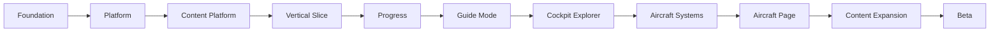

# CockpitPath Implementation

**Document status:** Active implementation dashboard

## Purpose

CockpitPath separates three kinds of project guidance:

- The [Product Roadmap](../product/roadmap.md) defines what product capabilities and releases CockpitPath aims to deliver.
- The [architecture documents](../README.md#architecture) and [ADRs](../README.md#architecture-decisions) define how the system is designed and why technical decisions were made.
- This implementation dashboard defines the dependency order in which the approved system is being built and links to the detailed execution plan for each phase.

Implementation phase numbers are technical checkpoints, not product-roadmap release numbers.

## Status Legend

- ✅ Complete
- ▶ Current
- ⬜ Planned
- ⏸ Deferred

## Current Position

- ✅ [Phase 0 — Product, UX, Design & Architecture Foundation](phase-0-foundation.md)
- ✅ [Phase 1A — Next.js Application Scaffold](phase-1-platform.md#phase-1a-nextjs-application-scaffold)
- ✅ [Phase 1B — Platform Foundation](phase-1-platform.md#phase-1b-platform-foundation)
  - ✅ [1B.0 — Architecture Migration to Neon](phase-1-platform.md#1b0-architecture-migration-to-neon)
  - ✅ [1B.1 — Neon Development & Migration Foundation](phase-1-platform.md#1b1-neon-development-migration-foundation)
  - ✅ [1B.2 — Neon Auth → PostgreSQL RLS Proof](phase-1-platform.md#1b2-neon-auth-postgresql-rls-proof)
  - ✅ [1B.3 — Application Authentication Integration](phase-1-platform.md#1b3-application-authentication-integration)
  - ✅ [1B.4 — Core Database Schema](phase-1-platform.md#1b4-core-database-schema)
  - ✅ [1B.5 — Database Security Foundation](phase-1-platform.md#1b5-database-security-foundation)
- ✅ [Phase 2 — Content Platform engineering foundation](phase-2-content-platform.md) — verified aircraft-content gate remains open
- ✅ [Phase 3 — Learning State & Progress](phase-3-progress.md)
- ✅ [Phase 4 — Guide Mode](phase-4-guide-mode.md)
- ✅ Work Package 3.5 — Staging Deployment + Real-Device Validation Foundation
- ▶ [Phase 5 — Cockpit Explorer](phase-5-cockpit-explorer.md)
- ⬜ [Phase 6 — Aircraft Systems](phase-6-aircraft-systems.md)
- ⬜ [Phase 7 — Aircraft Page](phase-7-aircraft-page.md)
- ⬜ [Phase 8 — Content Expansion](phase-8-content-expansion.md)
- ⬜ [Phase 9 — Beta Readiness](phase-9-beta-readiness.md)

## Current Checkpoint

**Current:** Phase 5 — Cockpit Explorer

**Previous:** Work Package 3.5 — Staging Deployment + Real-Device Validation Foundation<br>
**Commit:** `716fc7f` — `chore: establish Railway staging environment`

**Next:** Phase 6 — Aircraft Systems

Phase 1, the Phase 2 engineering foundation, Phase 3, Phase 4, and Work Package 3.5 are complete in committed Git history. The real Boeing/iFly technical-content gate remains open because verified source material and approved cockpit media have not yet been supplied; no unverified operational facts were published. Staging now provides an isolated Neon branch, Railway deployment contract, healthcheck, verified schema, restricted runtime credentials, and external-device validation foundation. Phase 5 is the current engineering focus.

## Major Delivery Path

This diagram represents dependency order, not dates.



Content precedes progress because progress needs stable content identities. Progress precedes Guide Mode so the first learning experience can save and resume real state. Explorer, Systems, and Aircraft Page then reuse the same connected content graph.

## Major Product Milestones

| Phase | Major value delivered |
| --- | --- |
| Platform Foundation | Authenticated, migration-driven, RLS-protected technical infrastructure |
| Content Platform | Real connected learning data and a publishable vertical slice |
| Guide Mode | First major end-user learning experience |
| Cockpit Explorer | Visual cockpit discovery using the shared cockpit graph |
| Aircraft Systems | Conceptual system learning linked to procedures and controls |
| Aircraft Page | Complete aircraft learning hub built from working experiences |
| Beta Readiness | Release-ready, verified, observable product |

## Completed Checkpoints

These mappings were verified against the repository's first-parent Git history.

| Checkpoint | Commit | Commit message |
| --- | --- | --- |
| Phase 0 | `0520323` | `docs: establish CockpitPath product and architecture foundation` |
| Phase 1A | `ec775e9` | `chore: establish Next.js application scaffold` |
| Phase 1B.0 | `7b2bd04` | `docs: migrate platform architecture to Neon` |
| Phase 1B.1 | `f7fec2f` | `chore: establish Neon migration foundation` |
| Phase 1B.2 | `54a9592` | `docs: record Neon Auth RLS access architecture` |
| Phase 1B.3 | `67c07f0` | `feat: integrate Neon Auth with Next.js` |
| Phase 1B.4 + 1B.5 | `cd9b84c` | `feat: establish core learning database foundation` |
| Phase 2 engineering foundation | `ab862b5` | `feat: establish content platform and publishing pipeline` |
| Phase 3 + Phase 4 | `09485cc` | `feat: implement learning progress and Guide Mode` |
| Work Package 3.5 | `716fc7f` | `chore: establish Railway staging environment` |

## Checkpoint Workflow

```text
Narrow task
→ verification
→ review
→ correction if required
→ commit
→ push
→ mark checkpoint complete
→ next task
```

A checkpoint is not complete merely because code exists. It is complete only when:

- Its exit criteria pass.
- Required functional, test, lint, build, migration, content, and security checks pass as applicable.
- Review is complete.
- The checkpoint is committed.

This documentation refactor does not commit or push.

When a checkpoint closes, update this dashboard and its phase document with the verified status and commit before beginning the next task.

## Phase Documents

- [Phase 0 — Foundation](phase-0-foundation.md): product, UX, design, content, data, architecture, and ADR foundation.
- [Phase 1 — Platform Foundation](phase-1-platform.md): application scaffold, Neon platform, identity proof, authentication, schema, and database security.
- [Phase 2 — Content Platform](phase-2-content-platform.md): content schemas, validation, publishing, and the first connected vertical slice.
- [Phase 3 — Learning State & Progress](phase-3-progress.md): persistent progress, autosave, resume, and Continue Learning.
- [Phase 4 — Guide Mode](phase-4-guide-mode.md): first major end-user procedure-learning experience.
- [Phase 5 — Cockpit Explorer](phase-5-cockpit-explorer.md): cockpit navigation, search, controls, and hotspots.
- [Phase 6 — Aircraft Systems](phase-6-aircraft-systems.md): systems, components, concepts, diagrams, and cross-links.
- [Phase 7 — Aircraft Page](phase-7-aircraft-page.md): aircraft learning hub and progress-aware entry points.
- [Phase 8 — Content Expansion](phase-8-content-expansion.md): verified expansion of the canonical v0.1 journey.
- [Phase 9 — Beta Readiness](phase-9-beta-readiness.md): security, quality, deployment, observability, and beta validation.

## Deferred / Post-MVP

The following capabilities are not part of the v0.1 critical path:

- Billing / `PRO` / `PACK` purchases
- Simulator telemetry / SimConnect
- AI instructor
- Community/social features
- Native applications
- Navigraph/SimBrief
- Advanced simulator integrations

Activating any deferred capability requires product prioritization and architecture/security review. Detailed future-product context remains in the [Product Roadmap](../product/roadmap.md).
